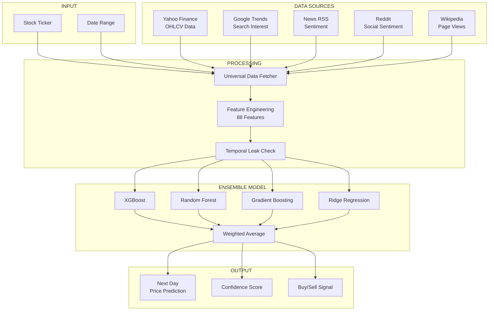
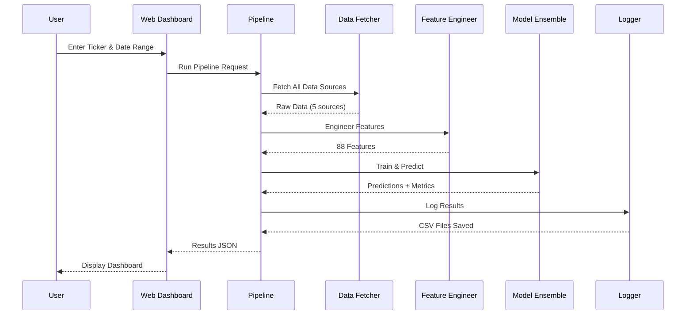
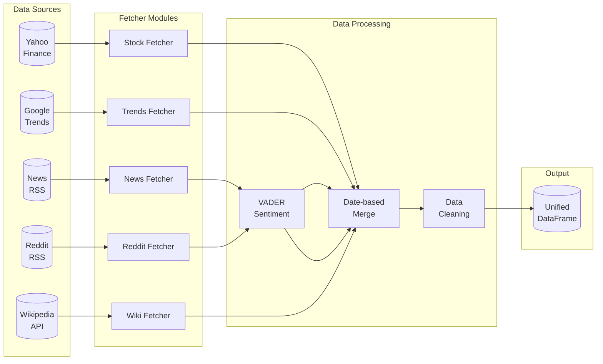
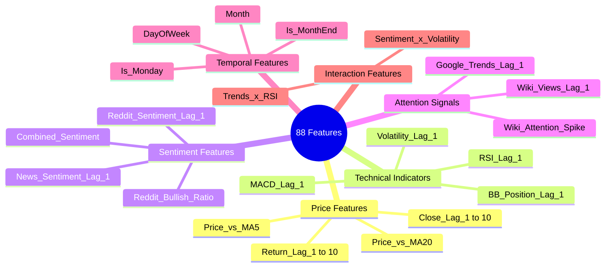
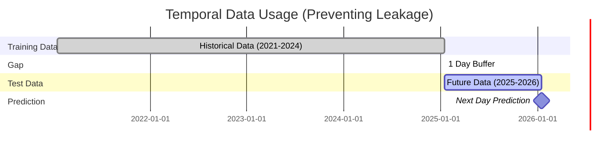
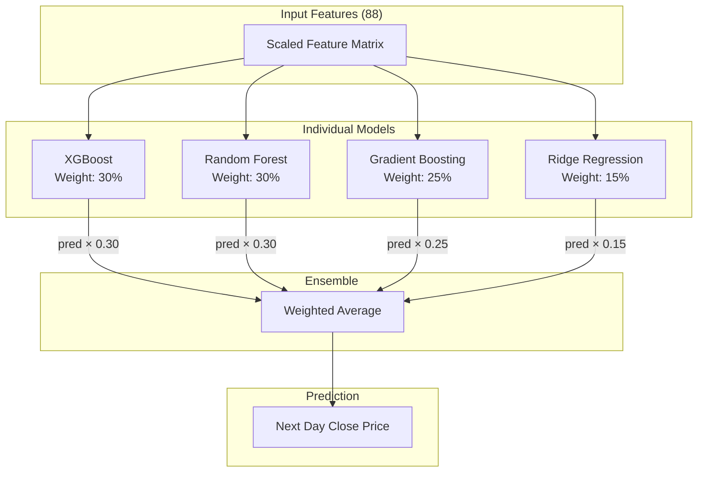

<div align="center">

# Project Kassandra

### Universal Sentiment Engine for Stock Price Prediction

[](https://python.org)
[](https://flask.palletsprojects.com)
[](https://xgboost.ai)
[](LICENSE)

*Predicting stock prices by combining technical analysis with multi-source sentiment data*

[Features](#features) • [Architecture](#architecture) • [Installation](#installation) • [Usage](#usage) • [API](#api-reference) • [Results](#results)

---

</div>

## Table of Contents

- [Overview](#overview)
- [Features](#features)
- [Architecture](#architecture)
- [Data Pipeline](#data-pipeline)
- [Feature Engineering](#feature-engineering)
- [Model Architecture](#model-architecture)
- [Installation](#installation)
- [Usage](#usage)
- [API Reference](#api-reference)
- [Results](#results)
- [Project Structure](#project-structure)
- [Technical Specifications](#technical-specifications)

---

## Overview

**Project Kassandra** is an end-to-end machine learning system that predicts next-day stock closing prices by leveraging both quantitative technical indicators and qualitative sentiment data from multiple sources.

### The Problem

Traditional stock prediction models rely solely on historical price data, ignoring the human psychology that drives market movements. News, social media sentiment, and public interest significantly impact stock prices.

### Our Solution

We built a **Universal Sentiment Engine** that:
- Scrapes data live from 5 different sources
- Engineers 88 predictive features
- Uses an ensemble of 4 ML models
- Enforces strict temporal leak prevention
- Provides a professional web dashboard

---

## Features

<table>
<tr>
<td width="50%">

### Live Data Scraping
- Yahoo Finance (stock prices)
- Google Trends (search interest)
- News RSS (Yahoo, MarketWatch, CNBC)
- Reddit (r/wallstreetbets, r/stocks)
- Wikipedia (page views)

</td>
<td width="50%">

### Advanced ML Pipeline
- 88 engineered features
- Ensemble of 4 models
- Walk-forward validation
- Temporal leak prevention

</td>
</tr>
<tr>
<td width="50%">

### Professional Dashboard
- Real-time predictions
- Interactive charts
- Sentiment indicators
- Feature importance visualization

</td>
<td width="50%">

### Robustness
- Multiple data source fallbacks
- Automatic error handling
- Comprehensive logging
- Production-ready API

</td>
</tr>
</table>

---

## Architecture

### System Overview



### Component Interaction



---

## Data Pipeline

### Data Flow Architecture



### Data Sources Specification

| Source | Library | Data Type | Update Frequency |
|--------|---------|-----------|------------------|
| Yahoo Finance | `yahooquery` | OHLCV | Daily |
| Google Trends | `pytrends` | Interest (0-100) | Weekly aggregated |
| News RSS | `feedparser` | Headlines + Sentiment | Real-time |
| Reddit | `requests` + RSS | Posts + Sentiment | Real-time |
| Wikipedia | REST API | Page views | Daily |

---

## Feature Engineering

### Feature Categories



### Temporal Leak Prevention



**Key Rules:**
1. All features use `.shift()` with positive lag
2. Target variable shifted negative (future)
3. Train/Test split is strictly chronological
4. 1-day gap enforced between sets

---

## Model Architecture

### Ensemble Strategy



### Model Hyperparameters

<details>
<summary><b>XGBoost Configuration</b></summary>

```python
XGBRegressor(
    n_estimators=200,
    max_depth=6,
    learning_rate=0.05,
    subsample=0.8,
    colsample_bytree=0.8,
    reg_alpha=0.1,
    reg_lambda=0.1
)
```
</details>

<details>
<summary><b>Random Forest Configuration</b></summary>

```python
RandomForestRegressor(
    n_estimators=200,
    max_depth=15,
    min_samples_split=5,
    min_samples_leaf=2
)
```
</details>

<details>
<summary><b>Gradient Boosting Configuration</b></summary>

```python
GradientBoostingRegressor(
    n_estimators=150,
    max_depth=5,
    learning_rate=0.05,
    subsample=0.8
)
```
</details>

<details>
<summary><b>Ridge Regression Configuration</b></summary>

```python
Ridge(alpha=1.0)
```
</details>

---

## Installation

### Prerequisites

- Python 3.9 or higher
- pip package manager
- Git

### Quick Start

```bash
# Clone the repository
git clone https://github.com/rishi02102017/ML-Codefest-Prometeo.git
cd ML-Codefest-Prometeo

# Create virtual environment (recommended)
python -m venv venv
source venv/bin/activate  # On Windows: venv\Scripts\activate

# Install dependencies
pip install -r requirements.txt
```

### Dependencies

```
yfinance==0.2.40
yahooquery>=2.4.0
pandas-datareader>=0.10.0
pandas>=2.0.0
numpy>=1.24.0
scikit-learn>=1.3.0
xgboost>=2.0.0
pytrends>=4.9.2
requests>=2.31.0
beautifulsoup4>=4.12.0
vaderSentiment>=3.3.2
feedparser>=6.0.10
flask>=3.0.0
flask-cors>=4.0.0
```

---

## Usage

### Command Line Interface

```bash
# Full pipeline with all features
python run.py TSLA --start 2021-01-15 --end 2026-01-15

# Quick mode (skip validation)
python run.py TSLA --start 2021-01-15 --end 2026-01-15 --quick

# Different stock
python run.py AAPL --start 2021-01-15 --end 2026-01-15
```

### Web Dashboard

```bash
# Start the server
python app.py

# Open browser to http://localhost:8080
```

### Python API

```python
from src.pipeline import KassandraPipeline

# Initialize pipeline
pipeline = KassandraPipeline()

# Run analysis
results = pipeline.run(
    ticker='TSLA',
    start_date='2021-01-15',
    end_date='2026-01-15'
)

# Get prediction
prediction = pipeline.predict_next_day()
print(f"Predicted Price: ${prediction['predicted_price']:.2f}")
print(f"Signal: {prediction['signal']}")
```

---

## API Reference

### Endpoints

| Method | Endpoint | Description |
|--------|----------|-------------|
| `GET` | `/` | Dashboard UI |
| `GET` | `/api/status` | System status |
| `POST` | `/api/run` | Run pipeline |
| `GET` | `/api/price-history` | Historical prices |
| `GET` | `/api/predictions-log` | Prediction history |

### POST /api/run

**Request:**
```json
{
    "ticker": "TSLA",
    "start_date": "2021-01-15",
    "end_date": "2026-01-15"
}
```

**Response:**
```json
{
    "success": true,
    "ticker": "TSLA",
    "prediction": {
        "price": 362.24,
        "last_close": 439.20,
        "change": -76.96,
        "change_pct": -17.52,
        "signal": "SELL",
        "confidence": 88.0
    },
    "metrics": {
        "mae": 31.30,
        "rmse": 41.79,
        "mape": 7.85,
        "r2": 0.6544
    }
}
```

---

## Results

### Performance Metrics (TSLA)

```
┌─────────────────────────────────────────────────────────┐
│                  MODEL PERFORMANCE                       │
├─────────────────────────────────────────────────────────┤
│                                                          │
│   MAE (Mean Absolute Error)     │  $31.30               │
│   RMSE (Root Mean Square Error) │  $41.79               │
│   MAPE (Mean Absolute % Error)  │  7.85%                │
│   R² Score                      │  0.6544               │
│                                                          │
│   Training Samples              │  1,002 days           │
│   Test Samples                  │  251 days             │
│   Total Features                │  88                   │
│                                                          │
└─────────────────────────────────────────────────────────┘
```

### Feature Importance

```
Close_Lag_1          ████████████████████████████████████████  53.4%
MA_5                 ██████████████████████████               35.0%
Close_Lag_2          ███                                       3.2%
EMA_12               █                                         1.2%
MA_10                ▌                                         0.4%
Return_Lag_5         ▌                                         0.4%
Price_Change         ▌                                         0.3%
Return_Lag_2         ▌                                         0.3%
Quarter              ▌                                         0.3%
Price_Change_Abs     ▌                                         0.3%
```

### Walk-Forward Validation

| Fold | Train Size | Test Size | MAE | MAPE |
|------|------------|-----------|-----|------|
| 1 | 200 | 50 | $15.44 | 5.21% |
| 2 | 250 | 50 | $21.29 | 13.63% |
| 3 | 300 | 50 | $5.78 | 2.72% |
| 4 | 350 | 50 | $16.14 | 4.95% |
| 5 | 400 | 50 | $15.58 | 4.17% |
| **Average** | - | - | **$14.85** | **6.14%** |

---

## Project Structure

```
ML-Codefest-Prometeo/
│
├── app.py                       # Flask web application
├── run.py                       # CLI pipeline runner
├── data_check.py                # Data verification script
├── requirements.txt             # Python dependencies
├── README.md                    # This file
│
├── src/                         # Source code
│   ├── __init__.py
│   ├── data_fetcher.py          # Multi-source data scraping
│   ├── feature_engineering.py   # 88 feature creation
│   ├── model.py                 # Ensemble ML model
│   ├── pipeline.py              # Orchestration logic
│   └── prediction_logger.py     # Results logging
│
├── static/                      # Frontend assets
│   ├── css/
│   │   └── styles.css           # Dashboard styling
│   └── js/
│       └── app.js               # Dashboard interactivity
│
├── templates/                   # HTML templates
│   └── index.html               # Dashboard UI
│
└── outputs/                     # Generated files
    ├── features_TSLA.csv        # Engineered features
    ├── prediction_log_TSLA.csv  # Predictions vs actuals
    └── metrics_report.txt       # Evaluation metrics
```

---

## Technical Specifications

### System Requirements

| Component | Minimum | Recommended |
|-----------|---------|-------------|
| Python | 3.9 | 3.10+ |
| RAM | 4 GB | 8 GB |
| Storage | 500 MB | 1 GB |
| CPU | 2 cores | 4+ cores |

### Data Specifications

| Parameter | Value |
|-----------|-------|
| Training Period | 2021-01-15 to 2025-01-14 |
| Testing Period | 2025-01-15 to 2026-01-15 |
| Total Trading Days | ~1,255 |
| Features Generated | 88 |
| Data Sources | 5 |

### Model Specifications

| Parameter | Value |
|-----------|-------|
| Ensemble Size | 4 models |
| Validation Method | Walk-forward (5 splits) |
| Scaling Method | RobustScaler |
| Train/Test Ratio | 80/20 |

---

## Competition

**Event:** Prometeo '26 - ML Codefest  
**Track:** FinTech  
**Challenge:** Project Kassandra - Universal Sentiment Engine

### Evaluation Criteria

- Pipeline Check (30%)
- Innovation & Alternative Data (40%)
- Model Explainability (30%)

---

## License

This project is licensed under the MIT License - see the [LICENSE](LICENSE) file for details.

---

<div align="center">

**Built for Prometeo '26 ML Codefest**

[Back to Top](#project-kassandra)

</div>
